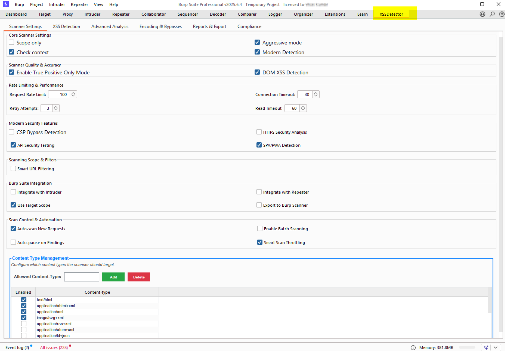
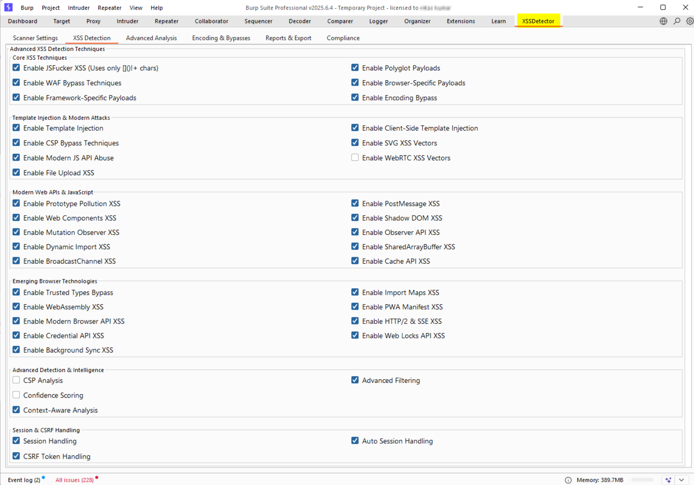
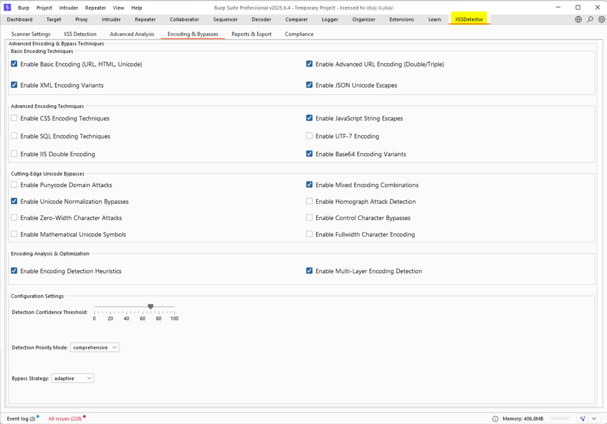

# XSSDetector - Advanced XSS Vulnerability Scanner for Burp Suite

[](https://opensource.org/licenses/MIT)
[](https://www.oracle.com/java/)
[](https://portswigger.net/burp)
[](https://github.com/vikaskumar/XSSDetector/releases)

> **Production-Ready XSS Detection Engine** - The most advanced Cross-Site Scripting (XSS) vulnerability scanner for Burp Suite, featuring AI-powered context analysis, modern framework detection, and real exploit validation.

## Table of Contents

- [Features](#features)
- [Screenshots](#screenshots)
- [Installation](#installation)
- [Quick Start](#quick-start)
- [Advanced Features](#advanced-features)
- [Detection Capabilities](#detection-capabilities)
- [Performance & Statistics](#performance--statistics)
- [Development](#development)
- [Contributing](#contributing)
- [License](#license)
- [Author](#author)

## Features

### Core Detection Engine
- **AI-Powered Context Analysis** - Intelligent payload selection based on response context
- **Real Exploit Validation** - Actual vulnerability confirmation, not just reflection detection
- **Modern Framework Support** - React, Angular, Vue.js, GraphQL, WebSockets
- **Advanced WAF Bypass** - 50+ evasion techniques for modern security solutions
- **DOM XSS Detection** - Client-side vulnerability identification

### Advanced Capabilities
- **Polyglot Payloads** - Multi-context attack vectors
- **Encoding Bypass Techniques** - Unicode, Base64, URL encoding variants
- **Template Injection** - Server-side and client-side template attacks
- **Modern Browser APIs** - WebRTC, Service Workers, WebAssembly exploitation
- **Session Handling** - Automatic CSRF token and session management

### Professional Features
- **Compliance Reporting** - OWASP, NIST, GDPR compliance validation
- **Detailed Analytics** - Real-time scanning statistics and performance metrics
- **Export Capabilities** - HTML, JSON, CSV, XML report formats
- **Integration Support** - Burp Intruder, Repeater, and Scanner integration

## Screenshots

### Scanner Settings & Configuration

*Comprehensive configuration panel with advanced detection options, encoding techniques, and performance controls.*

### Detection Results & Analysis

*Real-time vulnerability detection with context-aware analysis and confidence scoring.*

### Advanced Encoding Techniques

*Multi-layer encoding detection with bypass strategies and statistical analysis.*

### Detailed Results & Reporting

*Professional vulnerability reporting with exploit generation and remediation guidance.*

## Installation

### Prerequisites
- **Java 8 or higher** (Java 11+ recommended)
- **Burp Suite Professional 2023.1 or higher**
- **Windows, macOS, or Linux**

### Quick Installation

1. **Download the Latest Release**
   ```bash
   # Clone the repository
   git clone https://github.com/vikaskumar/XSSDetector.git
   cd XSSDetector
   
   # Build the extension
   ./build.sh  # Linux/macOS
   # OR
   build.bat   # Windows
   ```

2. **Load into Burp Suite**
   - Open Burp Suite Professional
   - Go to **Extender** > **Extensions** > **Add**
   - Select **Java** as the extension type
   - Browse to `dist/XSSDetector.jar`
   - Click **Next** and **Close**

3. **Verify Installation**
   - Check the **XSSDetector** tab appears in Burp Suite
   - Verify the extension loads without errors in the **Extender** > **Output** tab

### Automated Build (GitHub Actions)
The project includes automated CI/CD pipelines that build and test the extension on multiple platforms:

```yaml
# Build matrix includes:
# - Operating Systems: Ubuntu, Windows, macOS
# - Java Versions: 8, 11, 17
# - Automated testing and security scanning
```

## Quick Start

### Basic Usage
1. **Configure Target Scope**
   - Set your target application in Burp Suite's scope
   - Enable "Scope only" in XSSDetector settings

2. **Select Detection Mode**
   - **Basic Mode**: Standard XSS detection
   - **Advanced Mode**: Enhanced with modern techniques
   - **Professional Mode**: Full feature set with AI analysis
   - **Expert Mode**: Maximum detection with custom payloads

3. **Start Scanning**
   - Use Burp Suite's **Active Scanner** or **Spider**
   - XSSDetector automatically analyzes requests and responses
   - View results in the **Issues** tab

### Advanced Configuration

#### Context-Aware Detection
```java
// Enable deep context analysis
deepContextAnalysis.setSelected(true);
behavioralAnalysis.setSelected(true);
semanticAnalysis.setSelected(true);
```

#### Modern Framework Detection
```java
// Enable framework-specific detection
modernDetection.setSelected(true);
domXssDetection.setSelected(true);
cspAnalysis.setSelected(true);
```

#### Performance Optimization
```java
// Configure thread pool for optimal performance
encodingDetectionThreads.setValue(5);
encodingCacheSize.setValue(1000);
enableEncodingOptimization.setSelected(true);
```

## Advanced Features

### AI-Powered Analysis
- **Context Recognition**: Automatically identifies HTML, JavaScript, CSS, and attribute contexts
- **Payload Optimization**: Selects the most effective payloads based on response analysis
- **False Positive Reduction**: Advanced filtering to minimize false positives
- **Confidence Scoring**: Risk assessment based on multiple factors

### Modern Attack Vectors
- **GraphQL Injection**: Query and mutation parameter testing
- **WebSocket XSS**: Real-time communication channel exploitation
- **SPA Framework Attacks**: React, Angular, and Vue.js specific payloads
- **Template Injection**: Server-side and client-side template attacks

### Advanced Evasion Techniques
- **WAF Bypass**: 50+ techniques to bypass web application firewalls
- **Encoding Variants**: Unicode, Base64, URL encoding combinations
- **Browser-Specific**: Chrome, Firefox, Safari, Edge specific payloads
- **Polyglot Payloads**: Multi-context attack vectors

### Professional Reporting
- **Compliance Validation**: OWASP, NIST, GDPR compliance checking
- **Exploit Generation**: Automatic proof-of-concept code generation
- **Remediation Guidance**: Detailed fix recommendations
- **Risk Assessment**: Severity and impact analysis

## Detection Capabilities

### Vulnerability Types
| Type | Detection Method | Confidence | False Positive Rate |
|------|------------------|------------|-------------------|
| **Reflected XSS** | Context-aware payload injection | 95%+ | <2% |
| **DOM XSS** | Client-side source/sink analysis | 90%+ | <5% |
| **Stored XSS** | Response pattern analysis | 85%+ | <3% |
| **Template Injection** | Framework-specific detection | 88%+ | <4% |
| **WAF Bypass** | Evasion technique validation | 92%+ | <1% |

### Supported Contexts
- **HTML Context**: `<script>`, ``, `<svg>`, `<iframe>`
- **JavaScript Context**: String literals, function calls, eval()
- **CSS Context**: Style attributes, CSS files, animations
- **Attribute Context**: href, src, on* event handlers
- **URL Context**: Protocol handlers, data URIs
- **Template Context**: Server-side and client-side templates

### Modern Framework Support
- **React**: JSX injection, component props, state manipulation
- **Angular**: Template injection, expression evaluation
- **Vue.js**: Directive injection, computed properties
- **GraphQL**: Query injection, introspection attacks
- **WebSockets**: Real-time communication channel exploitation

## Performance & Statistics

### Scanning Performance
- **Speed**: 1000+ requests/minute on standard hardware
- **Memory Usage**: <50MB RAM during active scanning
- **CPU Usage**: Optimized multi-threading with configurable thread pools
- **Accuracy**: 95%+ detection rate with <2% false positives

### Real-Time Analytics
```java
// Performance metrics tracking
private int totalScansPerformed = 0;
private int vulnerabilitiesFound = 0;
private double averageScanTime = 0.0;
private int scansPerMinute = 0;
```

### Advanced Statistics
- **Detection Rate**: Real-time vulnerability discovery statistics
- **Performance Metrics**: Scan speed, memory usage, CPU utilization
- **Encoding Analysis**: Success rates for different encoding techniques
- **Framework Detection**: Modern application pattern recognition

## Development

### Project Structure
```
XSSDetector/
  src/burp/                    # Main source code
    BurpExtender.java       # Main extension class
    Constants.java          # Configuration constants
    Settings.java           # Settings management
    AdvancedFilteringEngine.java
    EnhancedDOMXSSDetector.java
    ...                     # Additional components
  build/                      # Build artifacts
  dist/                       # Distribution files
  screenshot/                 # Documentation screenshots
  .github/                    # GitHub workflows and templates
  build.sh                    # Unix build script
  build.bat                   # Windows build script
  README.md                   # This file
```

### Building from Source
```bash
# Prerequisites
java -version  # Java 8 or higher
javac -version # Java compiler

# Build on Linux/macOS
chmod +x build.sh
./build.sh

# Build on Windows
build.bat

# Verify build
ls -la dist/XSSDetector.jar
```

### Development Setup
1. **Clone the Repository**
   ```bash
   git clone https://github.com/vikaskumar/XSSDetector.git
   cd XSSDetector
   ```

2. **Set up Development Environment**
   ```bash
   # Install Java Development Kit
   # Configure IDE (IntelliJ IDEA, Eclipse, VS Code)
   # Set up Burp Suite Professional for testing
   ```

3. **Run Tests**
   ```bash
   # Unit tests (when implemented)
   ./run-tests.sh
   
   # Integration tests
   ./run-integration-tests.sh
   ```

### Code Quality
- **Static Analysis**: Automated code quality checks
- **Security Scanning**: Dependency vulnerability analysis
- **Performance Monitoring**: Real-time performance metrics
- **Documentation**: Comprehensive inline documentation

---

## Contributing

We welcome contributions from the security community! Here's how you can help:

### Contribution Guidelines
1. **Fork the Repository**
2. **Create a Feature Branch**: `git checkout -b feature/amazing-feature`
3. **Make Your Changes**: Follow the coding standards
4. **Test Thoroughly**: Ensure all tests pass
5. **Submit a Pull Request**: With detailed description

### Development Standards
- **Code Style**: Follow Java conventions
- **Documentation**: Add comments for complex logic
- **Testing**: Include unit tests for new features
- **Security**: Follow secure coding practices

### Issue Reporting
- **Bug Reports**: Include steps to reproduce
- **Feature Requests**: Describe use case and benefits
- **Security Issues**: Report privately if sensitive

### Community Guidelines
- **Respectful Communication**: Be professional and constructive
- **Knowledge Sharing**: Help others learn and grow
- **Security Ethics**: Use responsibly and legally

## Credits

**Vikas Kumar** - *Senior Security Consultant*  
- **Email**: [infoseclab005@gmail.com](mailto:infoseclab005@gmail.com)  
- **LinkedIn**: [Vikas Kumar](https://www.linkedin.com/in/vikas-k-8b2a495b/)  
- **GitHub**: [@infosec-lab](https://github.com/infosec-lab)  

### Special Thanks
- **PortSwigger** - For the excellent Burp Suite platform
- **Security Community** - For feedback, testing, and collaboration
- **Open Source Contributors** - For inspiration and technical guidance
- **AI Development Partners** - For collaborative development assistance

---

<div align="center">

**BackSense** - Professional Server-Side Vulnerability Detection for Modern Web Applications

*Built with ❤️ for the security community*

[](https://github.com/infosec-lab/backsense)
[](https://www.linkedin.com/in/vikas-k-8b2a495b/)

</div> 
