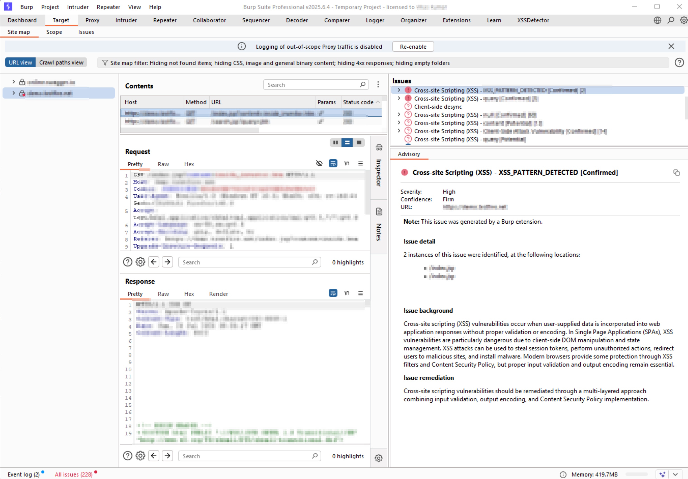

# XSSDetector — Advanced XSS Vulnerability Scanner for Burp Suite

<div align="center">

[](https://opensource.org/licenses/MIT)
[](https://www.oracle.com/java/)
[](https://portswigger.net/burp)
[](https://github.com/infosec-lab/XSSDetector/releases)

A Burp Suite extension that detects reflected XSS (HTML, attribute, JavaScript,
CSS and JSON/JSONP contexts) by injecting a context-aware probe and confirming a
live break-out with a working alert()/confirm()/prompt() payload — only verified,
reproducible findings, with no score thresholds and near-zero false positives.

</div>

## Screenshot


*Findings with payload, reflection context, exploit PoC, and steps to reproduce.*

## Features

- **Contextual reflection engine** — injects a unique canary interleaved with
  every break-out character, then measures *exactly* which characters survive
  unencoded at each reflection point and classifies the context with a real
  HTML/JS tokenizer
- **Live Results view** — findings stream into a real-time table (with a
  request/response viewer) as you browse and scan; right-side **smart filters**
  (search, severity, status, context) narrow the list instantly, and results
  export to CSV
- **Real-time browse feed** — reflections are flagged passively while proxying
  traffic (no injection) and upgraded to *Confirmed* automatically once an active
  scan verifies them
- **Two-stage live confirmation (near-zero false positives)** — a candidate is
  only reported after its context-specific proof-of-concept is injected for real
  and observed reflected **verbatim and unescaped** in the response; anything the
  application encodes, escapes, or a keyword/tag WAF blocks is suppressed
- **Full context coverage** — HTML text, HTML comments, tag/attribute-name
  positions, single/double/unquoted attribute values, URL attributes
  (`javascript:` scheme), `on*` event handlers, inline `<script>` blocks,
  JavaScript single/double/template strings, `<style>`/CSS, and rawtext/RCDATA
  elements (`textarea`, `title`, `iframe`, `xmp`, …) where only the matching end
  tag can break out — so inert reflections are never misreported
- **JSON & JSONP aware** — handles modern API responses: JSONP callback
  execution, JSON bodies rendered as HTML via wrong/sniffable `Content-Type`,
  while correctly treating strict `application/json` +
  `X-Content-Type-Options: nosniff` as non-exploitable
- **Header-reflected XSS** — `User-Agent`, `Referer`, `Origin`, `Host`,
  `X-Forwarded-For/-Host/-Proto/-Port`, `X-Original-URL`, `X-Rewrite-URL`,
  `X-Real-IP`/`X-Client-IP`/`True-Client-IP`, and `Accept-Language` are probed
  and confirmed the same way as URL/body/cookie parameters — not just Burp's
  `IParameter` set — so log/debug/admin viewers and Host-header-driven link
  generation are covered, not just query/body/cookie reflection
- **Dynamic, evidence-only reports** — each finding shows live data only: the
  reflection context, a per-character break-out table, the confirmed PoC, and the
  live reflected snippet (no boilerplate background or remediation text)
- **DOM XSS detection** — client-side source-to-sink data-flow analysis
- **Client-side checks** — postMessage, WebSocket, and template-injection patterns
- **Modern framework awareness** — React, Angular, Vue.js, GraphQL, WebSockets
- **WAF/filter bypass** — Unicode, Base64, and URL encoding plus mutation variants
- **Detailed HTML reports** — payload, context, exploit PoC, steps to reproduce, remediation
- **Confidence scoring** — configurable reporting threshold and duplicate filtering
- **Burp integration** — passive scanner, active scanner, and real-time proxy analysis

## Requirements

- Java 11 or higher (the JAR is compiled for Java 11 compatibility)
- Burp Suite Professional 2023.1 or higher

## Installation

A prebuilt `dist/XSSDetector.jar` is included. To build from source:

```bash
./build.sh    # Linux/macOS
build.bat     # Windows
```

Then in Burp: **Extender → Extensions → Add → Java**, select `dist/XSSDetector.jar`.
Confirm the **XSSDetector** tab appears and that there are no errors in
**Extender → Output**.

## Usage

The tab has two sections: **Live Results** (real-time findings table + smart
filters + request/response viewer) and **Settings** (detection + reporting, with
**Content Type Management** at the bottom for which response types to analyse).

1. Load the extension and open the **XSSDetector** tab. Nothing else to configure
   — the Contextual reflection engine and live auto-confirm are on by default.
2. (Optional) enable **Scan in-scope targets only** to restrict auto-confirm to
   Burp's Target scope; otherwise it auto-confirms everything you browse.
3. Browse the target: reflections appear live in **Live Results**. Run Burp's
   scanner (or right-click → Scan) to confirm them — confirmed findings also land
   in Burp's **Issues** tab with a live break-out table and a ready PoC.

See [REFERENCE.md](REFERENCE.md) for a short guide to the UI and navigation.

## Detection Scope

| Type | Method |
|------|--------|
| Reflected XSS | Contextual probe (canary + break-out characters) with per-context exploitability analysis |
| JSON / JSONP XSS | JSONP callback execution, JSON-rendered-as-HTML, and JSON string break-out (MIME/nosniff aware) |
| DOM XSS | Source-to-sink data-flow analysis |
| Stored XSS | Response pattern analysis on persisted input |
| Template Injection | Client-side template/expression pattern detection |
| WAF/Filter Bypass | Encoding and mutation technique variants |

### How the contextual engine works

Detection is a two-request, double-confirmed process per insertion point:

**Stage 1 — Measure.** The engine sends one probe of the form
`CANARY c0 CANARY c1 CANARY … CANARY`, where each `c` is a break-out character
(`< > " ' ` + `` ` `` + ` ( ) { } ; / \ = :` space `$ - !`). Because the canary is
pure `[a-z]` it passes through every output encoder unchanged, so splitting the
reflected block on the canary reveals precisely how the application transformed
each character (verbatim, HTML-entity-encoded, backslash-escaped, URL-encoded,
or stripped). A forward HTML/JS tokenizer — which models rawtext/RCDATA elements,
quoted/unquoted attributes, URL attributes, event handlers and JS
string/template literals — fixes the exact reflection context. Exploitability is
decided from the context plus the surviving characters (e.g. a double-quoted
attribute only when `"` survives unescaped; an inline script string only when its
delimiter survives unescaped or `</script>` can terminate the element).

For JSON/JS responses the engine switches to a JSON-aware path — in both the
active scan and the realtime browse feed — classifying **JSONP callback
execution**, **JSON rendered as HTML** (wrong/sniffable `Content-Type`, with
`<`-only or `< >`), and **JSON string break-out** (`"` reflected unescaped), while
still treating strict `application/json` + `nosniff` as non-exploitable.

**Stage 2 — Confirm.** The context-specific proof-of-concept is injected for real
and the response is checked for it reflected **verbatim and unescaped**. Only then
is an issue raised. This catches keyword/tag WAFs that pass single characters but
block whole payloads, and drives the false-positive rate to near zero. Each
finding reports only this live evidence — context, per-character break-out table,
confirmed PoC, and the highlighted reflection — with no remediation boilerplate.

> Findings carry a confidence score and are gated behind a configurable threshold
> to reduce false positives. As with any heuristic scanner, validate findings
> before disclosure.

## Building from Source

Requires a Java 11+ JDK. Run `./build.sh` (or `build.bat`); the output is
`dist/XSSDetector.jar`. A GitHub Actions workflow also builds the JAR on
Ubuntu/Windows/macOS with Java 11 and 17.

## Contributing

Issues and pull requests are welcome. There is no automated test suite yet —
validate changes manually against deliberately vulnerable apps such as the
PortSwigger Web Security Academy labs, OWASP Juice Shop, or DVWA.

## Security

See [SECURITY.md](SECURITY.md) for how to report a vulnerability.

## License

MIT — see [LICENSE](LICENSE).

## Contact

- **Email**: [infoseclab005@gmail.com](mailto:infoseclab005@gmail.com)
- **GitHub**: [@infosec-lab](https://github.com/infosec-lab)
